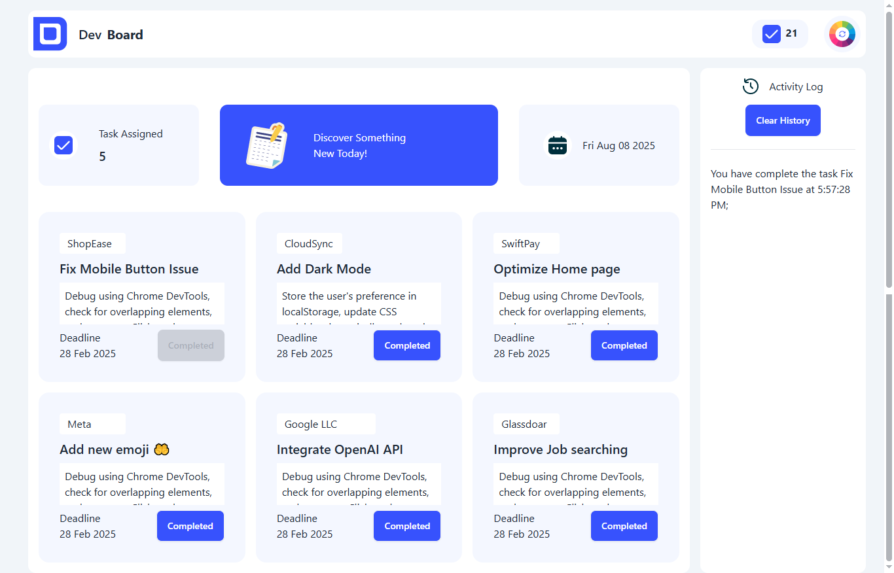

# 🗂️ Dev Board

A fully functional **Dev Board** built with **Tailwind CSS**, **DaisyUI**, and **JavaScript**.  
Manage your tasks, track progress, and keep a history of completed work — all in a simple and interactive interface.

---

## ✨ Features

- ✅ **Task Management** – Add tasks and mark them as complete.
- 🔒 **Disable Completed Tasks** – Once a task is done, its button is disabled to avoid duplication.
- 📉 **Live Task Counter** – Total task number decreases as tasks are completed.
- 🕒 **Completion History** – Sidebar shows all completed tasks with timestamps.
- 🗑 **Clear History** – One-click option to clear all history records.

---

## 🛠 Tech Stack

- **Tailwind CSS** – For modern, responsive styling.
- **DaisyUI** – UI components for a polished design.
- **JavaScript (Vanilla)** – Core functionality and interactions.

---

## 📸 Screenshots




---

## 🚀 How to Run Locally

1. Clone the repository:
   ```bash
   git clone https://github.com/ZakariyaHussain/dev_board.git
